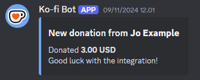

# Simple Ko-fi -> Discord Webhook

This is a Cloudflare Workers app for the sole purpose of transforming Ko-fi donation/subcription webhook to Discord webhook. Below is the example of what it will look like in Discord.

## Prerequisites

1. Cloudflare Account
2. Node.js (tested on v22.11.0)
3. npm, yarn, or npm

## Quick Start Guide

1. Clone this repository.
2. Duplicate `.dev.vars.example` with the name `.dev.vars`.
3. Make sure to make a webhook in a channel in your server. Here is a [handy guide](https://support.discord.com/hc/en-us/articles/228383668-Intro-to-Webhooks) from Discord itself. Copy the URL, open `.dev.vars`, paste to `DISCORD_WEBHOOK_URL`.
4. Go to [this Ko-fi page](https://ko-fi.com/manage/webhooks) (you might need to log in), under Webhooks, click the Advanced button, copy the verification token, go back to `.dev.vars`, paste to `KOFI_VERIFICATION_TOKEN`.
5. *(Optional)* Feel free to modify the rest of the variables in that file.
6. Run `npm i` for packages installation.
7. Run `npm run deploy` (you might get prompted for login). Wait for a few seconds or minutes until a URL popped in your terminal. Copy that URL, go back to [this Ko-fi page](https://ko-fi.com/manage/webhooks), paste the URL into the Webhook URL field, and click Update.
8. Test if it works by scrolling down and clicking the various tests. If it works, you're done!

## Troubleshooting

TBA

## License

This project is licensed under *Do What The Fuck You Want To Public License (WTFPL)*, see [LICENSE.txt](LICENSE.txt) for the full license text.

## Donate

If you like my work, feel free to donate!

